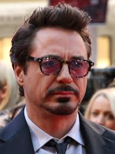
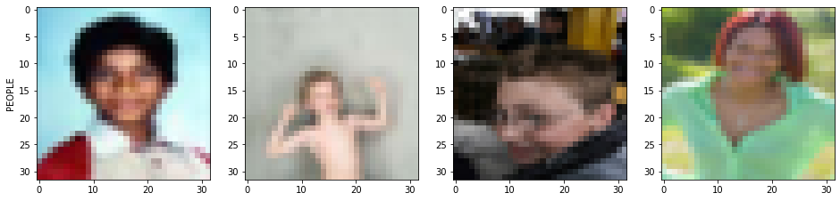
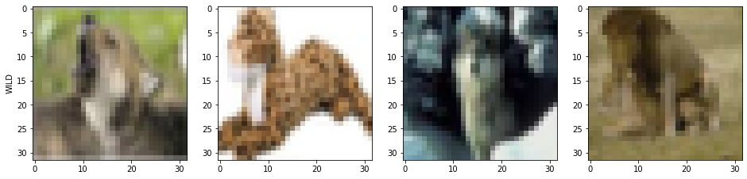

# Man vs Wild

## Problem statement

Classify an image as People or Wild animal using transfer learning.

## Concept

+ This is an image of you know who...  ;-)



+ Our obejctive is to train a classifier to detect whether the object in the image is PEOPLE or WILD.

+ In order to do so, we make use of CIFAR-100 dataset which contains images of 100s of classes.

+ We create 2 broad classes from those:

    + PEOPLE: "baby","boy","girl","man","woman"
    + WILD: "bear", "leopard", "lion", "tiger", "wolf",

+ Here are few sample images of PEOPLE class:




+ Here are few sample images of WILD class:



+ We make use of a pre-trained model called VGG19 which was trained on ImageNet, a database containing images of 1000s of classes.

+ <a href="https://www.cs.toronto.edu/~frossard/post/vgg16/vgg16.png">VGG architecture</a>


+ It's a CNN architecture. In every subsequent layer, the model learns a hierarchical representation of the image feature. The first layer learns to detect edges, the next layer learns to detect shapes and so on. The final layers of such architectures are fully-connected layers followed by the final output layer.

+ We make use of the pre-trained model by freezing the final fully-connected layers. 

+ We extract image features using the pre-trained model on our own dataset.

+ Then, our new model architecture consists of fully-connected layers whose input are the image features extracted using the pre-trained model and output is the probability of the labels (PEOPLE=1,WILD=0).

+ 
```
Model Summary
Model: "sequential_56"
_________________________________________________________________
Layer (type)                 Output Shape              Param #   
=================================================================
flatten_49 (Flatten)         (None, 512)               0         
_________________________________________________________________
dense_126 (Dense)            (None, 32)                16416     
_________________________________________________________________
dropout_72 (Dropout)         (None, 32)                0         
_________________________________________________________________
dense_127 (Dense)            (None, 2)                 66        
=================================================================
Total params: 16,482
Trainable params: 16,482
Non-trainable params: 0


```

+ Once trained, our prediction pipeline looks like this:

    + Resize image to 32x32X3
    + Extract features by passing the image through the pre-trained layers.
    + Make predictions on the extracted features using our new model.


## Results

```
Best validation loss: 0.29
Training loss: 0.2057

Validation accuracy: 0.8720
Training accuracy: 0.9209 

Test accuracy: 0.79
```

Yes, there's an overfitting problem. As per the bias-variance trade-off, this means that variance is more.

We we can reduce it by:

+ Adding more quality data.
+ Tuning the hyper-parameters like Dropout, learning-rate, number of layers, number of neurons per layer, etc.

## Demo

1. Prepare data for training
```
> python data_prep.py
```
2. Train a model. It will save the best model to data/model.best.hdf5. The model structure will be saved to data/model_structure.json.
```
> python training.py 
```
3. Run demo.py to classify two sample images.


+ **demo_animal.png**


```
> python demo.py --path data/demo_animal.png

Predicted probability (in %) => {'WILD': 95.26, 'PEOPLE': 4.74}
```

What's interesting is that our model didn't train on detecting Rocket umm.. Raccoons! Yet, it learnt to figure out that it's WILD !


+ **demo_people.png**


```
> python demo.py --path data/demo_people.jpg

Predicted probability (in %) => {'WILD': 0.0, 'PEOPLE': 100.0}
```


## References

+ https://keras.io/applications/
+ https://towardsdatascience.com/transfer-learning-from-pre-trained-models-f2393f124751
+ https://www.hackerearth.com/practice/machine-learning/transfer-learning/transfer-learning-intro/tutorial/


That's it, folks!

